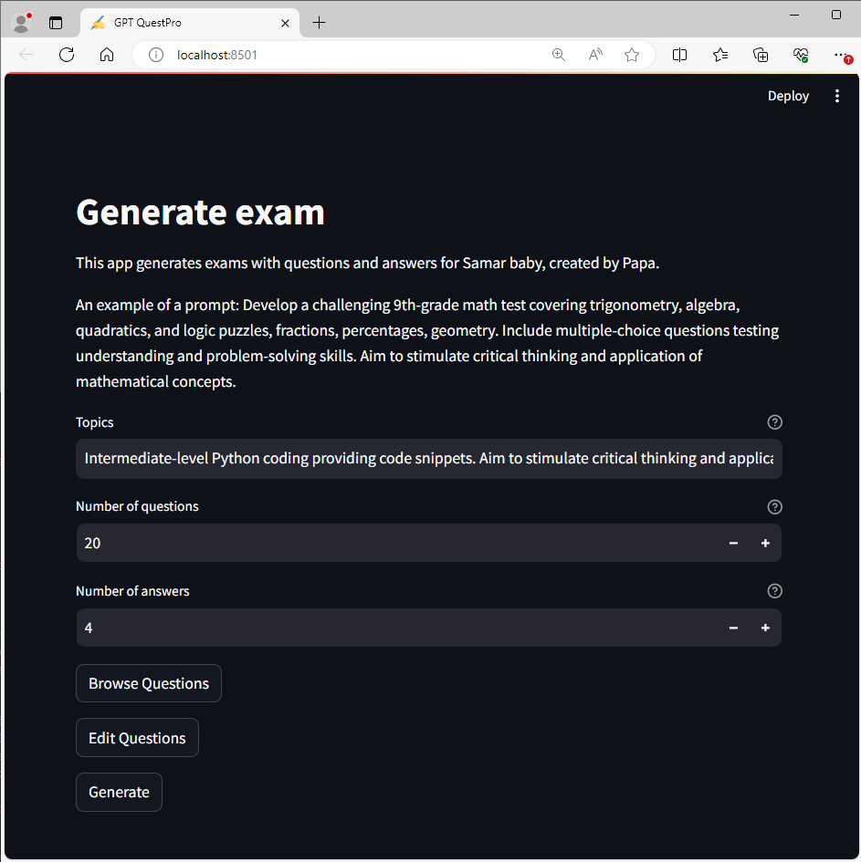
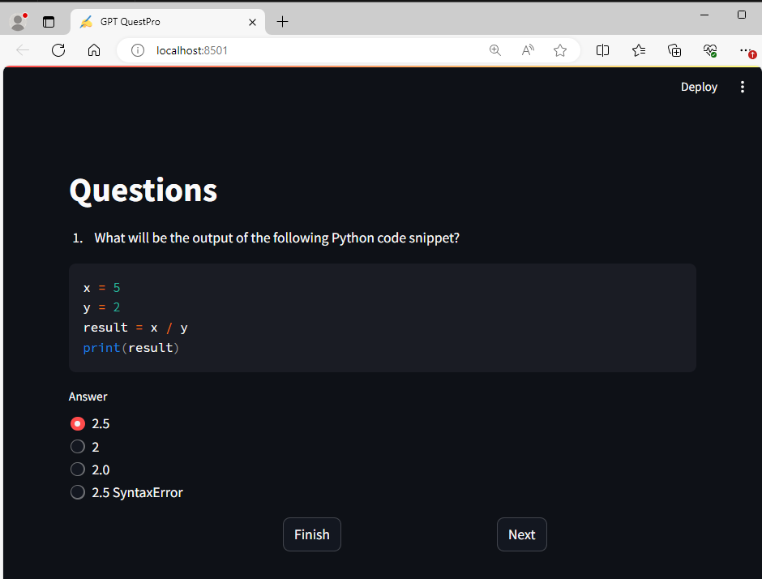
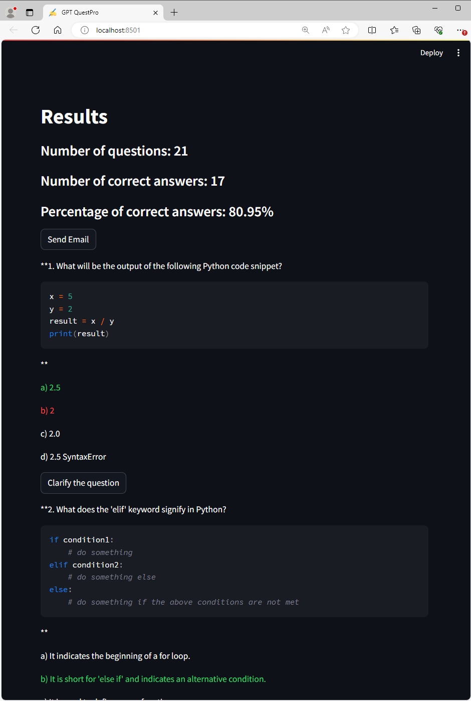
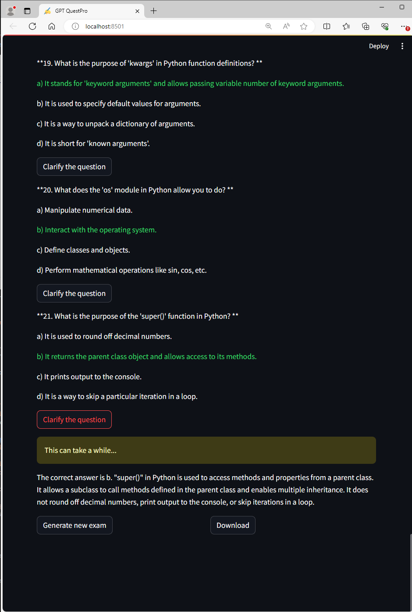
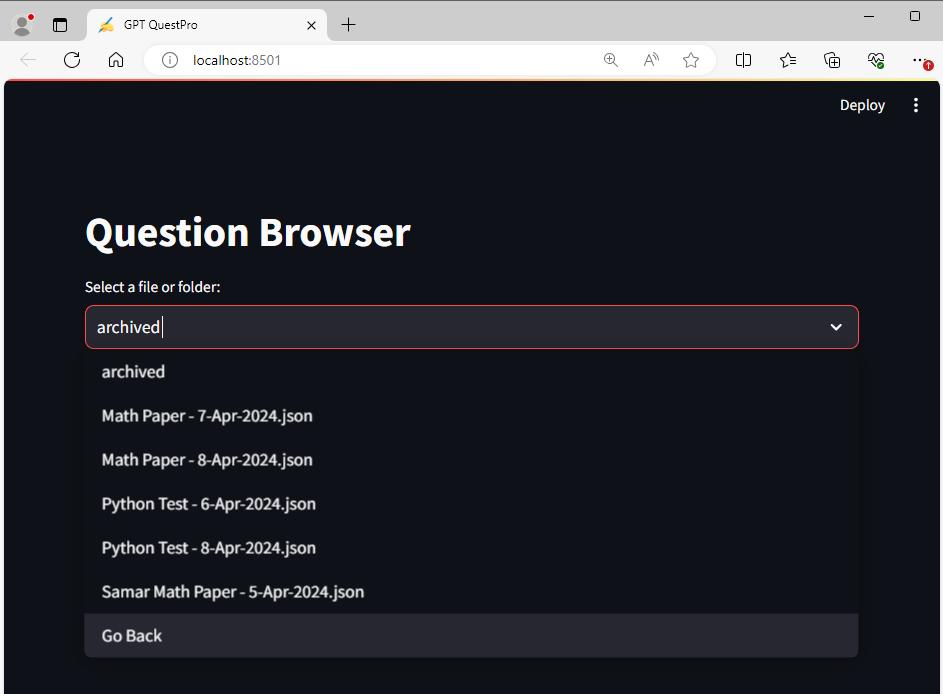
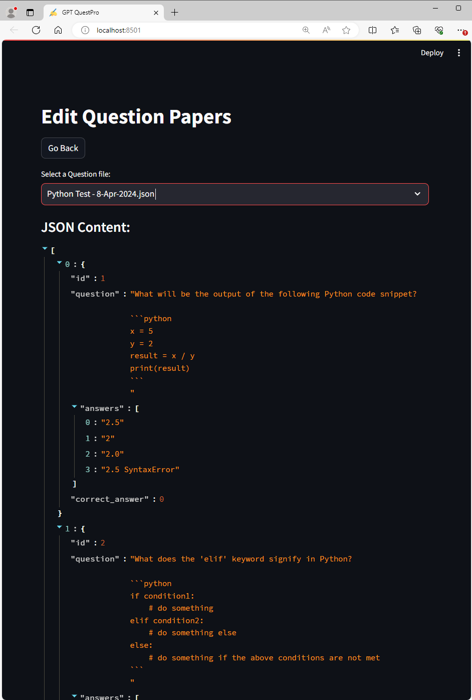

# GPT QuestPro powered by GPT-3.5 and written in Python/Streamlit

Introducing GPT-QuestPro, an innovative app designed with a personal touch. As a parent, I found myself spending countless hours creating exam papers for my 10-year-old son, only to struggle with evaluating his progress afterward. This tedious process inspired me to develop GPT-QuestPro, leveraging the power of Chat-GPT to generate multiple-choice online exams effortlessly. With just a prompt, the app crafts customized question papers, allowing my son to test his knowledge in various subjects. Not only does this save valuable time for me, but it also provides my son with an engaging learning experience while enabling me to track his improvement effectively. GPT-QuestPro transforms the way we approach learning and assessment, making education both efficient and enjoyable.

## Table of Contents

- [Requirements](#requirements)
- [Installation](#installation)
- [Obtaining OpenAI API Keys](#obtaining-openai-api-keys)
- [Setting Secrets](#setting-secrets)
- [Setting Email](#setting-email)
- [Executing the App](#executing-the-app)
- [Contributing](#contributing)
- [License](#license)

## Requirements

To use GPT QuestPro, you need the following:

- Python 3.8 or higher
- An OpenAI API key to access GPT-3.5

## Installation

1. Clone the repository to your local machine:

```
git clone https://github.com/ankur-katiyar/GPT-QuestPro.git
```

2. Change to the project directory:

```
cd GPT-QuestPro
```

3. Create a virtual environment and activate it:

```
python3 -m venv venv
source venv/bin/activate
```

Alternatively, you can use `conda` to create a virtual environment:

```
conda create -n GPT-QuestPro python=3.9
conda activate GPT-QuestPro
```

4. Install the required packages from `requirements.txt`:

```
pip install -r requirements.txt
```

## Obtaining OpenAI API Keys

To obtain the necessary API key and organization from OpenAI, follow these steps:

1. Go to the [OpenAI website](https://www.openai.com/).
2. If you don't have an account, click "Sign up" and create one.
3. Once logged in, navigate to the [API key management page](https://platform.openai.com/account/api-keys).
4. Click "Create new secret key" and note down the generated API key (you would not see the key again).
5. On the same page, find your organization ID under the "Settings" section.

You now have the API key and organization ID required for GPT QuestPro.

## Setting Secrets

Create new directory `.streamlit` in the root directory of the project and create a new file `secrets.toml` inside it.

```
mkdir .streamlit
touch .streamlit/secrets.toml
```

Open the `secrets.toml` file and add the following lines:

```
OPENAI_TOKEN = <yout-token>
OPENAI_ORG = <your-org>
```
**Note:** If it's a personal account, you can leave `OPENAI_ORG` as an empty string ("").

## Setting Email

1. **Open or Create `config.ini` File in the root directory**: 
   - If the `config.ini` file doesn't exist, create a new file named `config.ini`.
   - If it already exists, open the existing `config.ini` file.

2. **Add Email Configuration**:
   - Under the `[Email]` section, fill in the following details:
     - `sender_email`: Your sender email address (e.g., "your_sender_email@gmail.com").
     - `receiver_email`: The recipient email address (e.g., "your_receiver_email@gmail.com").
     - `sender_password`: Your email account password.

**Note:** Make sure that you don't enclose the values with double-quotes.

3. **Save the `config.ini` File**:
   - Save the changes made to the `config.ini` file.


## Executing the App

After installing dependencies and setting secrets, execute GPT QuestPro app by running:

```
streamlit run GPT-QuestPro.py
```

The GPT QuestPro app should now be accessible in your web browser at `http://localhost:8501`.


## GPT-QuestPro

1. **Home Page**

   
   Home Page.

2. **Generate Questions**

   
   Generate Questions by providing prompt. Change 'number of questions' and 'number of answers' as required.

3. **Taking the Test**

   
   Take the test.

4. **Result Page**

   
   Result page - summarizes the result with an option to send the summary to an email address.

5. **Clarification & Download Questions**

   
   When reviewing the result, you can clarify the responses to a question or download the question in pdf format.

6. **Questions Browser**

   
   This page allows to take the test on a question paper that had already been generated. This allows for saving the API calls to OpenAI.

7. **Questions Editor**

   
   This page allows to edit questions and their responses in case Chat GPT provides incorrect answers or duplicate choices. This is frequent when dealing with math papers so always a good idea to review the questions before handing them over for examination.


## Contributing

I welcome contributions to improve GPT QuestPro. If you'd like to contribute, please fork the repository and create a pull request with your proposed changes. I'll review and merge the changes as appropriate.

## License

This project is licensed under the MIT License. See the [LICENSE](LICENSE) file for more information.
